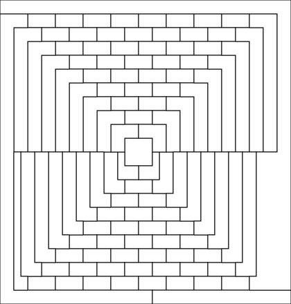
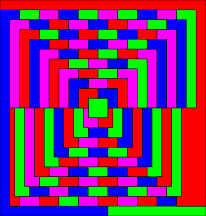

# mapcolor

`mapcolor` colors SVG maps with a SAT-backed four-color solver.

The input SVG should contain map regions as `<rect>` or `<polygon>` elements with
stable `id` attributes. The colored SVG is written to stdout by default.

## Example

| Input | Output |
| --- | --- |
|  |  |

## Install

```sh
uv sync
```

## Usage

```sh
uv run mapcolor in.svg > out.svg
```

Write directly to a file:

```sh
uv run mapcolor in.svg --output out.svg
```

Show CLI help:

```sh
uv run mapcolor --help
```

The module entry point also works:

```sh
uv run python -m mapcolor in.svg > out.svg
```

## Development

Run the test suite:

```sh
uv run pytest
```

## License

MIT License. See [LICENSE](LICENSE).
